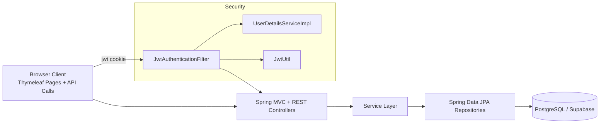
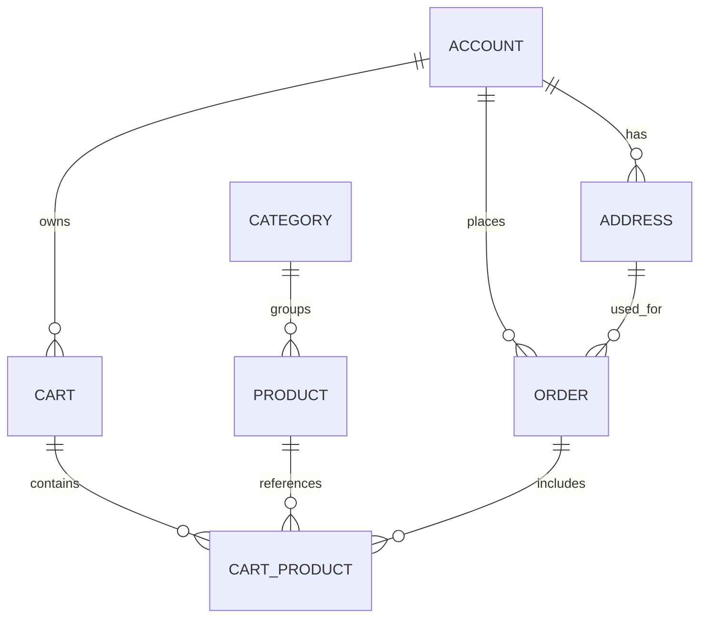

# Kaffe Technical Design and Architecture

## 1. Purpose and Scope

This document describes the current technical architecture of the `kaffe` project as implemented in source code under `src/`.

Scope includes:
- Application structure and module boundaries
- Runtime architecture and request flow
- Data model and persistence design
- Security and authentication design
- Configuration model (including Supabase profile)
- Frontend template architecture
- Testing and operational considerations

Out of scope:
- Build outputs in `build/` and `bin/` (generated artifacts)
- Non-code process documentation

## 2. System Overview

`kaffe` is a monolithic Spring Boot web application combining:
- Server-rendered pages (Thymeleaf)
- REST API endpoints for domain resources
- JWT cookie-based stateless authentication
- PostgreSQL persistence (Supabase in default profile)

Primary entrypoint:
- `src/main/java/com/me/kaffe/KaffeApplication.java`

The design follows a standard layered architecture:
- Presentation layer: MVC + REST controllers
- Service layer: application services for CRUD orchestration
- Data access layer: Spring Data JPA repositories
- Domain layer: JPA entities and relationships
- Infrastructure: Spring Security, JWT, datasource/JPA configuration

### 2.1 High-Level Architecture Diagram

### 2.2 Domain Relationship Diagram

## 3. Technology Stack

From `build.gradle` and configuration files:
- Java 17 (`toolchain`)
- Spring Boot 4.0.3
- Spring Data JPA + Hibernate
- Spring Security
- Spring MVC + Thymeleaf
- PostgreSQL driver (runtime)
- JWT via `io.jsonwebtoken` (`jjwt-api`, `jjwt-impl`, `jjwt-jackson`)
- Lombok
- Gradle build system
- Test DB: H2 (test scope)

## 4. Project Structure and Responsibilities

Root-level design-relevant files:
- `build.gradle`: dependencies and plugins
- `settings.gradle`: root project naming
- `src/main/resources/application.properties`: default profile + datasource behavior
- `src/main/resources/application-supabase.properties`: Supabase datasource/JPA/JWT properties
- `.env.supabase.example`: expected externalized environment variables

Code package structure under `src/main/java/com/me/kaffe`:
- `configuration.security`: security filter chain and auth wiring
- `configuration.security.impl`: JWT filter and `UserDetailsService` implementation
- `controller`: REST and web controllers
- `dto`: request DTO base + auth request payload classes
- `entity`: domain model and ORM mappings
- `repository`: JPA repositories
- `security`: JWT utility
- `service`: business/service layer for entities

Template structure under `src/main/resources/templates`:
- Pages: `home.html`, `menu.html`, `about.html`, `shipment.html`, `login.html`, `register.html`
- Shared fragments: `fragments/head.html`, `fragments/navbar.html`

## 5. Runtime Architecture

### 5.1 Logical Components

1) Browser client
- Accesses web pages (`/`, `/menu`, `/about`, `/shipment`, `/login`, `/register`)
- Sends form posts for login/register
- Stores JWT in `jwt` HTTP-only cookie

2) Spring MVC/REST layer
- `WebController` serves static-rendered page routes
- `AuthController` handles login/logout/register flows
- Resource controllers expose CRUD APIs under `/api/**`

3) Security layer
- `SecurityConfiguration` defines route protection and stateless session policy
- `JwtAuthenticationFilter` extracts JWT from cookie, validates it, and sets authentication context
- `UserDetailsServiceImpl` maps `Account` to Spring Security `UserDetails`

4) Service + repository layer
- Services currently implement direct CRUD delegation
- Repositories provide persistence via Spring Data JPA

5) Database
- PostgreSQL (Supabase intended by default profile)
- Hibernate generates/updates schema based on JPA mappings (`ddl-auto` configurable)

### 5.2 Request Flow (Authenticated API)

1. Client requests `/api/...` with `jwt` cookie.
2. `JwtAuthenticationFilter` runs before `UsernamePasswordAuthenticationFilter`.
3. Filter extracts token from cookie and resolves username via `JwtUtil`.
4. `UserDetailsServiceImpl` loads account by username.
5. If valid, Spring Security context is populated.
6. Controller executes and returns JSON response.

### 5.3 Authentication Flow

Login (`POST /login` in `AuthController`):
1. Credentials are authenticated by `AuthenticationManager`.
2. JWT is generated by `JwtUtil`.
3. JWT stored in HTTP-only `jwt` cookie (`path=/`, max age 1 day).
4. User is redirected to `/`.

Register (`POST /register`):
1. Checks username uniqueness via `AccountRepository.findByUsername`.
2. Persists `Account` with encoded password and role `CUSTOMER`.
3. Auto-issues JWT cookie and redirects to `/`.

Logout (`GET /logout`):
1. Sends cleared `jwt` cookie (`maxAge=0`).
2. Redirects to `/login?logout`.

## 6. Data Model and Persistence

Entities are UUID-based (`GenerationType.UUID`) and mapped to relational tables.

### 6.1 Entity Inventory

- `Account` (`account`)
  - Fields: `username`, `password`, `fullName`, `number`, `role`
  - Relations: one-to-many carts, addresses, orders

- `Address` (`address`)
  - Fields: `isDefault`, `city`, `details`
  - Relations: many-to-one account, one-to-many orders

- `Cart` (`cart`)
  - Relations: many-to-one account, one-to-many cartProducts

- `CartProduct` (`cart_product`)
  - Fields: `quantity`
  - Relations: many-to-one cart, product, order

- `Category` (`category`)
  - Fields: `name`, `description`
  - Relations: one-to-many products

- `Product` (`product`)
  - Fields: `name`, `sku`, `size`, `image`, `description`
  - Relations: many-to-one category, one-to-many cartProducts

- `Order` (`"order"`)
  - Fields: `status`
  - Relations: many-to-one account/address, one-to-many cartProducts

- `Role` enum: `CUSTOMER`, `ADMIN`, `EMPLOYEE`

### 6.2 Relationship Summary

- `Account` 1..* `Cart`
- `Account` 1..* `Address`
- `Account` 1..* `Order`
- `Category` 1..* `Product`
- `Cart` 1..* `CartProduct`
- `Product` 1..* `CartProduct`
- `Order` 1..* `CartProduct`
- `Address` 1..* `Order`

### 6.3 Repository Design

Each aggregate has a dedicated repository extending `JpaRepository<..., UUID>`.
- Custom query currently present only in `AccountRepository` (`findByUsername`).

## 7. API and Web Surface

### 7.1 Page Routes (Thymeleaf)

Served by `WebController` and `AuthController`:
- `GET /`
- `GET /menu`
- `GET /about`
- `GET /shipment`
- `GET /login`, `POST /login`
- `GET /register`, `POST /register`
- `GET /logout`

### 7.2 REST Endpoints

CRUD resources (all under `/api`):
- `/api/accounts`
- `/api/addresses`
- `/api/carts`
- `/api/cart-products`
- `/api/categories`
- `/api/orders`
- `/api/products`

Each resource controller provides:
- `GET /`
- `GET /{id}`
- `POST /`
- `PUT /{id}`
- `DELETE /{id}`

## 8. Security Architecture

### 8.1 Route Policy

Defined in `SecurityConfiguration`:
- Public: page routes (`/`, `/menu`, `/about`, `/shipment`, `/login`, `/register`) and static path patterns (`/css/**`, `/js/**`, `/images/**`)
- Protected: `/api/**` requires authentication
- Session policy: `STATELESS`
- CSRF: disabled
- Form login/logout filters: disabled (custom controller-based flow used)

### 8.2 JWT Strategy

- Token contains subject (`username`), issue time, expiration
- Secret and expiration are externalized properties (`jwt.secret`, `jwt.expiration-ms`)
- JWT transport via HTTP-only cookie named `jwt`

### 8.3 User Principal Mapping

`UserDetailsServiceImpl` maps persisted account role to authorities:
- `ROLE_CUSTOMER`, `ROLE_ADMIN`, `ROLE_EMPLOYEE`

## 9. Configuration and Environments

### 9.1 Default Profile Behavior

From `application.properties`:
- `spring.profiles.default=supabase`
- `spring.datasource.embedded-database-connection=none`

This enforces non-embedded DB usage by default and activates Supabase profile properties unless overridden.

### 9.2 Supabase Profile

From `application-supabase.properties`:
- Optional import of `.env.supabase`
- JDBC URL from `DATABASE_URL` or host/port/db fallbacks
- PostgreSQL driver and dialect set explicitly
- Hikari pool size configurable
- JPA `ddl-auto` configurable (default `update`)

Expected env contract documented in `.env.supabase.example`.

### 9.3 Test Configuration

`src/test/resources/application.properties` uses H2 in-memory DB with PostgreSQL mode and `create-drop` lifecycle for tests.

## 10. Frontend Template Architecture

- Thymeleaf pages are mostly static content currently (marketing + auth screens)
- Shared layout components:
  - `fragments/head.html`: title and Tailwind CDN include
  - `fragments/navbar.html`: navigation + auth visibility via Spring Security tags
- Auth pages (`login.html`, `register.html`) post to MVC auth endpoints
- Main pages do not yet consume API-backed dynamic product/catalog data

## 11. Testing and Quality Status

Current automated test coverage is minimal:
- `KaffeApplicationTests.contextLoads()` only verifies context startup under test profile

No dedicated tests found for:
- Controller behavior
- Security rules and JWT filter behavior
- Repository integration queries beyond defaults
- Service-level business logic

## 12. Architectural Strengths

- Clear and conventional Spring layering simplifies onboarding
- Clean separation between web pages and API endpoints
- Stateless JWT auth implementation is straightforward
- Supabase profile and env-based configuration support deployment portability
- UUID identifiers avoid sequence coordination issues across environments

## 13. Risks and Design Gaps

1) Entity exposure directly in REST APIs
- Controllers accept/return JPA entities, increasing coupling and risk of over-posting/serialization issues.

2) Limited validation and DTO usage
- DTO classes exist (`LoginRequest`, `RegisterRequest`) but are not used in controller methods, and validation is not enforced.

3) Missing role-based authorization
- APIs are authenticated but not role-segmented (`ADMIN` vs `CUSTOMER` operations not differentiated).

4) CSRF disabled with cookie-based auth
- For browser cookie auth, CSRF strategy should be intentionally reviewed.

5) Schema management in runtime
- `ddl-auto=update` is convenient for development but can be risky in production without migration tooling.

6) Limited test coverage
- Only context-load test currently; regression risk increases as features grow.

## 14. Recommended Evolution Roadmap

Priority 1:
- Introduce request/response DTOs for resource APIs and auth endpoints.
- Add bean validation (`jakarta.validation`) and centralized exception handling.
- Add integration tests for auth flow and protected API access.

Priority 2:
- Add fine-grained authorization with role-based endpoint constraints.
- Add migration tool (Flyway or Liquibase) and move away from runtime schema mutation in production.
- Add API pagination/filtering for list endpoints.

Priority 3:
- Connect Thymeleaf menu/catalog pages to real product/category data.
- Add audit fields (created/updated timestamps) and basic observability (request logging, health metrics).

## 15. Source Coverage Matrix

This document is derived from:
- Build/config: `build.gradle`, `settings.gradle`, `README.md`, `HELP.md`, `.env.supabase.example`, `.env.supabase`, `src/main/resources/application.properties`, `src/main/resources/application-supabase.properties`, `src/test/resources/application.properties`
- App/security: `src/main/java/com/me/kaffe/KaffeApplication.java`, `src/main/java/com/me/kaffe/configuration/security/SecurityConfiguration.java`, `src/main/java/com/me/kaffe/configuration/security/impl/JwtAuthenticationFilter.java`, `src/main/java/com/me/kaffe/configuration/security/impl/UserDetailsServiceImpl.java`, `src/main/java/com/me/kaffe/security/JwtUtil.java`
- Domain/persistence: all files under `src/main/java/com/me/kaffe/entity`, `src/main/java/com/me/kaffe/repository`, `src/main/java/com/me/kaffe/service`
- Controllers: all files under `src/main/java/com/me/kaffe/controller`
- DTOs: all files under `src/main/java/com/me/kaffe/dto`
- Templates: all files under `src/main/resources/templates`
- Tests: `src/test/java/com/me/kaffe/KaffeApplicationTests.java`
